# Cuaderno 2 

Este Cuaderno muestra el desarrollo del segundo cuaderno de la asignatura, el cual incluye 4 ejercicios.

### Pasos Previos

Antes de si quieras empezar hay que seccionarte de tener disponible 2 apartados fundamentales:

* Una Cámara funcional ya sea incluida con el portatil o que se conecte al propio ordenador
* Un entorno virtual creado con Python, opencv-python y matplotlib instalado (En este cuaderno se utilizará Anaconda)

### Desarrollo

Para empezar dentro de nuestro cuadernos tendremos unas librerías instaladas:

```python
import cv2  
import numpy as np
import matplotlib.pyplot as plt
```
 
* **OpenCV (cv2)**: Se utiliza para la captura y procesamiento de imágenes y video en tiempo real. En el cuaderno se usará para capturar videos de la cámara web y añadir figuras sobre fotogramas. Es la librería principal de tratamiento de Fotogramas

* **NumPy (np)**: Proporciona estructuras de datos eficientes. En el cuaderno se usa para manipular datos de las imágenes y es una opción para crear un collage.

* **Matplotlib (plt)**: Se usa para la visualización de imágenes en gráficos y ventanas. Lo utilizaremos para enseñar imágenes procesadas, aunque no es indispensable para los ejercicios que incluyan la cámara en tiempo real.

Una vez están esas librerías instaladas, se puede empezar por las propias tareas

#### Preparación 

Cabe destacar que se hara varios ejercicios sobre una imagen original denominada Mandril.jpg, es por ello que empezamos con un codigo simple que carga la foto del Mandril, la pone en gris para mejor trabajo y más importante le aplica canny que se utilizará en el siguiente ejercicio

```python
import cv2  
import numpy as np
import matplotlib.pyplot as plt
```

<div align="center"> Versión Original </div>

<div align="center">
    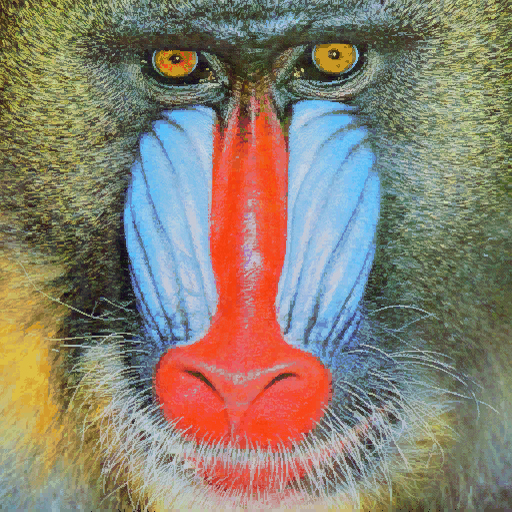
</div>

<div align="center"> Canny </div>

<div align="center">
    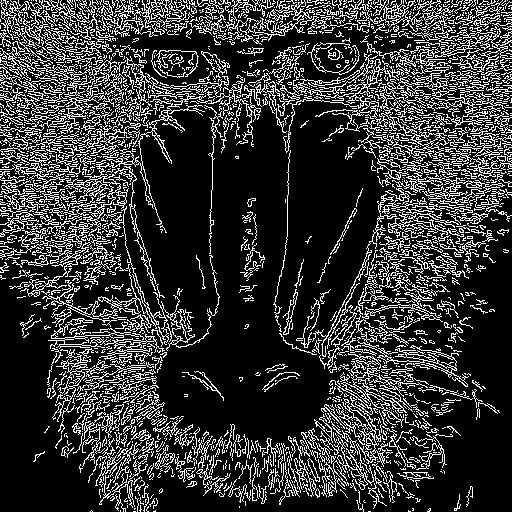
</div>

#### Tarea 1 - Realizar varios ejercicios sobre un canny

En esta primera tarea utilizaremos el canny el cual es una operación la cual obtiene una imagen que muestra solo los bordes de los objetos, lo que ayuda a identificar formas y contornos en la imagen. Esta primera tarea tiene varias subapartados, estos son:

1. Contar el número de pixeles NO nulos de la imagen canny y representanlo en una grafica
2. Decir cual es la columna con más pixeles NO nulos
3. Decir cuales son las columnas con un número de pixeles NO nulos superior o igual al 95% del número de pixeles NO nulos mayor
4. Repetetir el proceso entero de los apartados 1, 2 y 3 pero con las filas

Para la realización de este apartado vamos a separar todas estas tareas en 3 apartados (en el codigo se ve separado por barras comentadas)

1. Primero tendremos el calculo de los pixeles no nulos tanto por columnas como por filas guardadas en las variables col_counts y row_counts corresponientes, así mismo se guardará en las variables cols y rows respectivamente los porcentajes de los pixeles no nulos respecto a los totales. Guardamos los datos de col_counts y row_counts en otras variables para trabajo más simple ya que los originales estan puestas de manera más complejas, y sacamos con un simple max los valores máximos

2. Luego escribimos por pantalla los resultados de los valores de los máximos y calculamos y escribimos por pantalla las columnas que su número de pixeles esta por encima del 95% del máximo 

3. Por ultimo, cogemos los valores sacados arriba y representamos los valores en unas graficas con un formato simple de la imagen a la izquierda y la grafica a la derecha.

<div align="center">
    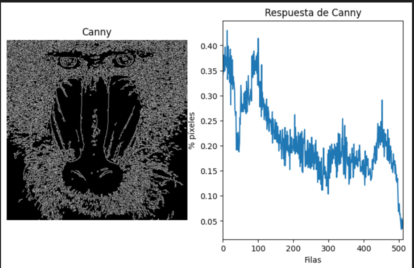
</div>

#### Tarea 2 - Realizar varios ejercicios sobre una imagen Umbralizada

Esta tarea es parcialmente igual a la anterior con unos cambios, se nos pide exactamente los mismo que la anterior pero con el añadido de que los máximos y los mayores del 95% debe representarse en una imagen, por ultimo el cambio más significativo es el hecho de que esto se aplica sobre el umbralizado de la imagen del Mandril pero con un sobel anterior.

Para la realización de este apartado nuevamente vamos a separar todas estas tareas en apartados 5 para ser exactos(en el codigo se ve separado por barras comentadas)

1. Primero hay que hacer el proceso aplicar sobel sobre la imagen del Mandril y luego aplicar el Umbralizado. 

        Sobel es un proceso el cual hace un calculo matematico sobre los pixeles de la imagen lo cual provoca que remarque con fuerza las diferencias entre un pixel y otro esto provoca que 40 pixeles de una camisa por ejemplo no se refleje en el sobel pero en el momento que el siguiente pixel muestre un fondo que sería el final de la camisa, al haber un cambio brusco es representado, lo que provoca que solo muestre la silueta de la imagen

        El proceso de Umbralizar por el otro lado es aplicar un valor umbral a la imagen lo cual toma los pixeles cuyos valores solo esten por encima del umbral

<div align="center">
    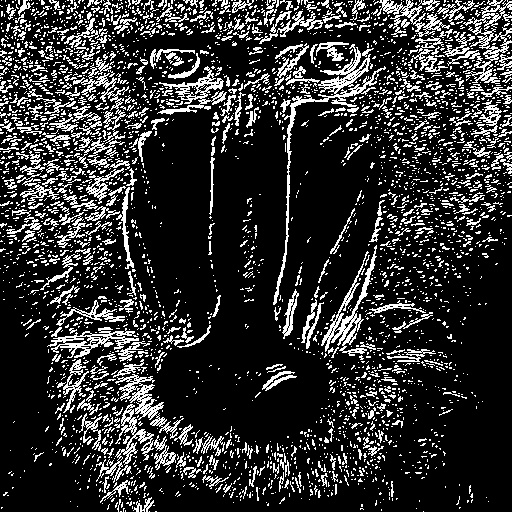
</div>

2.  La segunda parte sería hacer el mismo calculo empleado en la tarea 1 en el primer apartado, donde se calcula el número de pixeles NO nulos de las columnas y las filas, máximos de ambos, etc.

3. En la tercera parte, creamos una copia con canales de color de la imagen y empezamos a poner lineas en las posiciones para representar las columnas y filas máximas más las filas y columnas con valores por encima del 95%, luego utilizamos el comando cv2.addWeighted para añadir todas las lineas.

4. Luego en el cuarto apartado creamos una leyenda que muestre que representa cada color

<div align="center">
    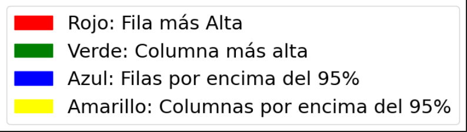
</div>
<div align="center">
    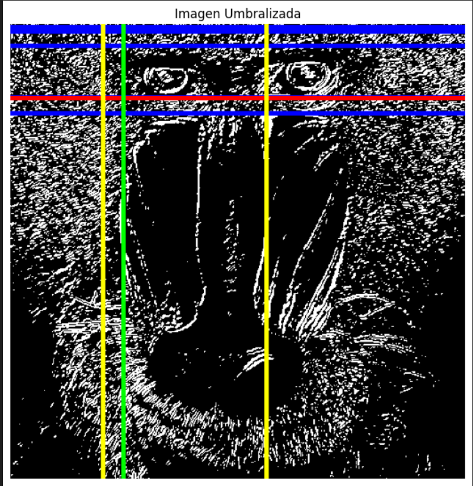
</div>

5. Por ultimo, mostramos los resultados de las graficas nuevamente como en la tarea anterior

#### Tarea 3 - Monstrar lo aprendi en este apartado pero en una videocámara

Para realizar este apartado vamos a tener que tener en cuenta dos apartados previos

1. Recorda aquel "esquelo" explicado en el Cuaderno anterior para la vizualización de una videocámara 

```python
vid = cv2.VideoCapture(0)

while(True):      
    ret, frame = vid.read()

    if ret:
        cv2.imshow('Vid', frame)

    if cv2.waitKey(20) == 27:
        break

vid.release()
cv2.destroyAllWindows()
```
2. Modificar el esquelo anterior monstrado para poder añadir modos que alteren el resultado dependiendo del modo

```python
vid = cv2.VideoCapture(0)

modo = 1

while True:
    ret, frame = vid.read()

    if ret:

        if modo == 1:
            output_frame = frame
        elif modo == 2:
            output_frame = frame
        elif modo == 3:
            output_frame = frame
        cv2.imshow("Default", output_frame)

    key = cv2.waitKey(20) & 0xFF

    if key == 27: 
        break
    elif key == ord('1'):  
        modo = 1
    elif key == ord('2'): 
        modo = 2
    elif key == ord('3'):  
        modo = 3

vid.release()
cv2.destroyAllWindows()
```

Este codigo muestra por pantalla la imagen de nuestra camara y aunque a mera precencia no haga nada al pulsar las teclas 1, 2 y 3 cambia el modo del codigo permitiendo alterar output_frame para tener filtros dependientes del modo del que esta, pero como dicho anteriormente actualmente no hace nada y todos los modos muestra las imagen por defecto. 

Ahora vamos a modificar el modo 2 y 3 para aplicar cosas de las anteriores tareas concretamente el sobel y el canny. 

Para aplicar el canny en el modo 2 solo debemos coger el frame actual de la cámara y pasarlo por canny 

```python
        elif modo == 2:

            framegris = cv2.cvtColor(frame, cv2.COLOR_BGR2GRAY)
            canny = cv2.Canny(framegris, 25, 200)
            output_frame = cv2.bitwise_not(canny)

            cv2.setWindowTitle("Default", 'Canny')
```

Aqui un pequeño ejemplo:

<div align="center">
    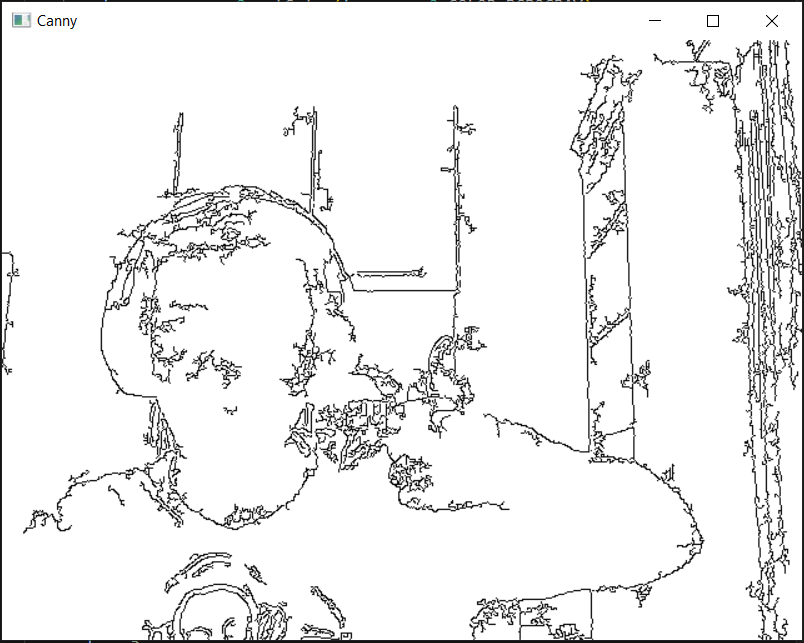
</div>

Para el caso del Sobel aplicariamos los mismo, aplicar sobel sobre cada frame

```python
        elif modo == 3:

            framegris = cv2.cvtColor(frame, cv2.COLOR_BGR2GRAY)
            sobel = cv2.Sobel(framegris, cv2.CV_64F, 1, 0, ksize=3) 

            sobel8 = cv2.convertScaleAbs(sobel)
            output_frame = cv2.cvtColor(sobel8, cv2.COLOR_GRAY2BGR)

            cv2.setWindowTitle("Default", 'Sobel')
```
Otro ejemplo: 

<div align="center">
    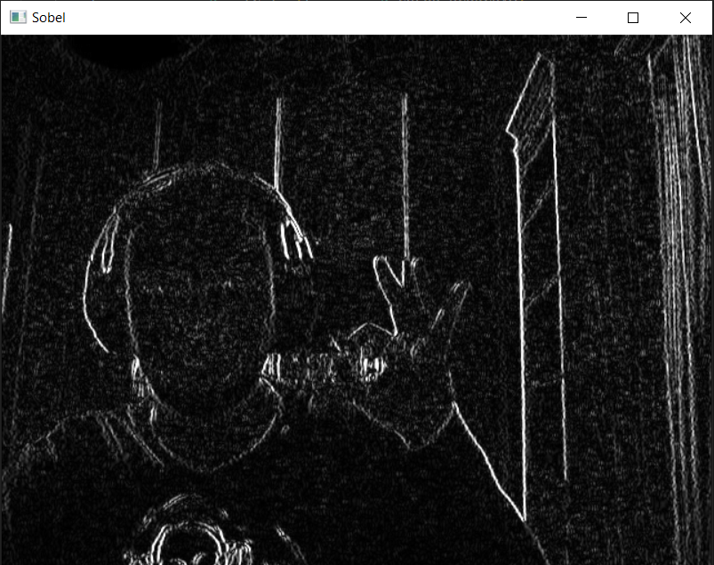
</div>

#### Tarea 4 - Plantear una reinterpretación de la parte de procesamiento de la imagen

Esta última tarea es algo más independiente y pide un concepto más único e independiente. En mi caso he decido realizar algo parecido al apartado anterior, donde cada modo aplicará un sobel siendo la particularidad de tener además una máscara la cual dertinará un canal de color, es decir tendremos un modo que solo aplicara un sobel sobre el canal rojo, otro sobre el canal verde y otro sobre el azul, creando un efecto donde la pantalla puede estar totalmente negra pero tener siluetas y contornos exclusivamente a objetos del color correspondiente 

Para la realización de esto tomaremos el esqueleto de antes:

```python
vid = cv2.VideoCapture(0)

modo = 1

while True:
    ret, frame = vid.read()

    if ret:

        if modo == 1:
            output_frame = frame
        elif modo == 2:
            output_frame = frame
        elif modo == 3:
            output_frame = frame
        cv2.imshow("Default", output_frame)

    key = cv2.waitKey(20) & 0xFF

    if key == 27: 
        break
    elif key == ord('1'):  
        modo = 1
    elif key == ord('2'): 
        modo = 2
    elif key == ord('3'):  
        modo = 3

vid.release()
cv2.destroyAllWindows()
```

En el que cambiaremos los modos por algo más simple

```Python
while True:
    ret, frame = vid.read()
    
    if ret:

        if modo == 1:

            output_frame = AplicarSobel(frame, "Rojo")
            cv2.setWindowTitle("Default", 'Sobel en Rojo')

        elif modo == 2:

            output_frame = AplicarSobel(frame, "Verde")
            cv2.setWindowTitle("Default", 'Sobel en Verde')

        elif modo == 3:

            output_frame = AplicarSobel(frame, "Azul")
            cv2.setWindowTitle("Default", 'Sobel en Azul')

        cv2.imshow("Default", output_frame)

    cv2.imshow("Frame Original", frame) 
    key = cv2.waitKey(20) & 0xFF
```

A costar de crear una función llamada "AplicarSobel" la cual piede el frame actual y el canal a elegir (dependiente del modo) y crea la máscara para poder representar el efecto anterior dicho

```Python
def AplicarSobel(frame, color):
    hsv = cv2.cvtColor(frame, cv2.COLOR_BGR2HSV)
    
    # Máscara

    if color == "Rojo":
        LowerRojo1 = np.array([0, 120, 70])
        UpperRojo1 = np.array([10, 255, 255])
        LowerRojo2 = np.array([140, 120, 70])
        UpperRojo2 = np.array([160, 255, 255])

        Mascara1 = cv2.inRange(hsv, LowerRojo1, UpperRojo1)
        Mascara2 = cv2.inRange(hsv, LowerRojo2, UpperRojo2)
        Mascara = Mascara1 + Mascara2

    elif color == "Verde":
        LowerVerde = np.array([25, 50, 50]) 
        UpperVerde = np.array([95, 255, 255])  
        Mascara = cv2.inRange(hsv, LowerVerde, UpperVerde)

    elif color == "Azul":
        LowerAzul = np.array([85, 100, 20]) 
        UpperAzul = np.array([155, 255, 255])  
        Mascara = cv2.inRange(hsv, LowerAzul, UpperAzul)

    # Aplicación de Sobel
    
    FrameEsmacarado = cv2.bitwise_and(frame, frame, mask=Mascara)
    FrameEsmacaradoGris = cv2.cvtColor(FrameEsmacarado, cv2.COLOR_BGR2GRAY)
    
    sobelx = cv2.Sobel(FrameEsmacaradoGris, cv2.CV_64F, 1, 0, ksize=3)
    sobely = cv2.Sobel(FrameEsmacaradoGris, cv2.CV_64F, 0, 1, ksize=3)

    sobelCombained = cv2.convertScaleAbs(cv2.add(sobelx, sobely))

    sobelFinal = cv2.cvtColor(sobelCombained, cv2.COLOR_GRAY2BGR)
    FrameFinal = cv2.bitwise_and(sobelFinal, sobelFinal, mask=Mascara)

    return FrameFinal
```

La función se divide en dos apartados, crear la máscara y aplicar el sobel

* La máscara se crea a partir de la imagen original pasado a un formato hsv la cual se denomina como H: Hue (Tono), S: Saturation (Saturación)y  V: Value (Valor o Brillo), este modo se utiliza para crear la máscara solo detectando valores de un rango de colores cercanos al canal deseado. Es importante entender una cosa que es que el azul y el verde solamente se cogen a partir unos valores en concreto entre 0 y 255 que son sus valores más notorios, [25 - 95] para el verde y [85 - 155] para el azul, cuanto más alto sea ese rango más permisivo será la restricción de los colores con un azul claro por ejemplo. En el caso del rojo se tiene dos rangos, por el inicio y por el final, el motivo de esto es que aparece en ambas partes entre 0 y 255, los rangos son [0 - 10] y [140 - 160] nuevamente aumentar estos valores aumenta su permisividad.

* Aplicar el sobel es bastante simple, lo unico interesante de ello es utilizar el comando bitwise el cual realiza una operación AND bit a bit, luego se realiza las misma operaciones de un sobel convecional.

Por último se muestra algunos ejemplos, a la izquierda habra una cámara normal si ningún filtro para verificar la veraciada de la prueba:

<div align="center">
    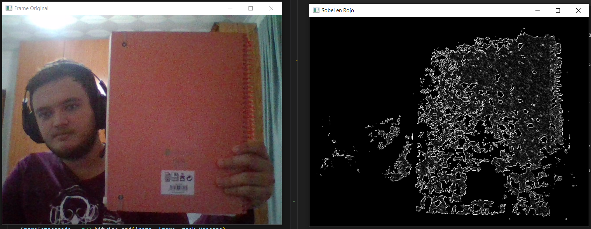
</div>

<div align="center">
    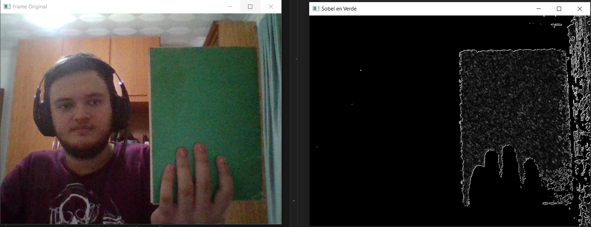
</div>

<div align="center">
    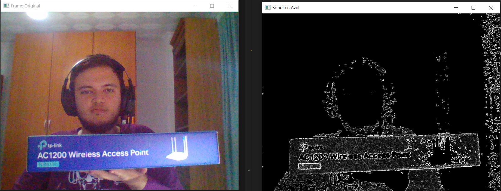
</div>